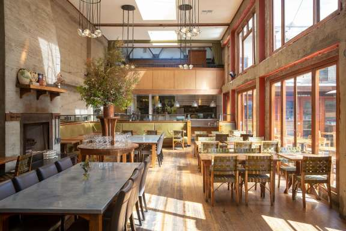
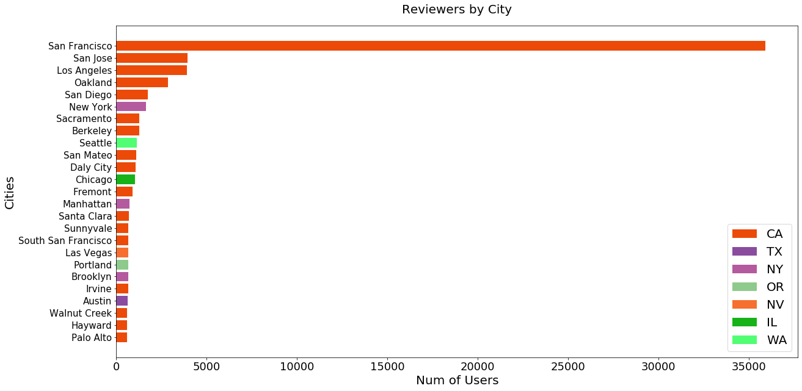

# Restaurant Recommender

### Premise

Many people like to dine in SF. I am creating a restaurant recommender that will recommend restaurants based on the name of a restaurant visited.

### Setup
I collected the data from Yelp and saved it into a MongoDB database. Once I got the data, I converted the data into a csv format. This file shows the setup: `src/convert_to_csv.py`

### Data
Data Collected:
- 1000 restaurants
- 312k users
- 715k reviews

### EDA
I grouped the restaurants based on the neighborhood and did an analysis of the number of reviews per neighborhood

From the graphs, the Mission Neighborhood has the highest number of reviews.

Here is a breakdown based on:

1. Ambience

2. Noise Level

3. Alcohol

Here is a graph of the number of reviews based on ratings

#### Reviewers by City

