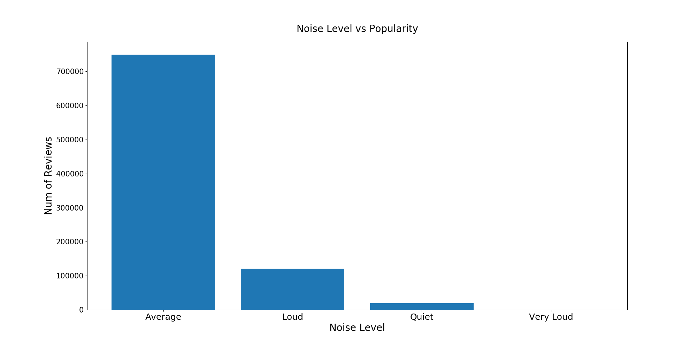

# Restaurant Recommender

### Premise

Many people like to dine in SF. I am creating a restaurant recommender that will recommend restaurants based on the name of a restaurant visited.

### Setup
I collected the data from Yelp and saved it into a MongoDB database. Once I got the data, I converted the data into a csv format. This file shows the setup: `src/convert_to_csv.py`. 
EDA: `src/eda_restaurants.py` & `src/eda_users.py`
Recommendations: `src/recommendations.py`

### Data
Data Collected:
- 1000 restaurants
- 312k users
- 715k reviews

### EDA
I grouped the restaurants based on the neighborhood and did an analysis of the number of reviews per neighborhood

From the graphs, the Mission Neighborhood has the highest number of reviews.

Here is a breakdown based on:

1. Ambience

2. Noise Level

3. Alcohol

Here is a graph of the number of reviews based on ratings

#### Reviewers by City

### Recommender System
I built a baseline model, using the content based filtering

#### Content Based Filtering
Restaurants have different properties, e.g. neighborhood, ambience, cuisines, price, noise level etc

I decide to build the model based on certain factors that will guide my recommendation. As a user, when I search for a restaurant, I tend to look for similar restaurants with the same cuisines, price range and ratings. This help me with deciding on the cuisines, price and stars as my input to build a similarity matrix to recommend restaurants. I broke down the cuisines field into dummies and combine with the price and stars column to generate the matrix for my recommendation.

I built a 2nd and 3rd recommendation system using reviews from reviewers and description texts from restaurants

As for these other 2 recommenders, I use the reviews and description of the restaurant as my input and vectorize it to create a similarity matrix for my recommendation.

### Source
Yelp Website
