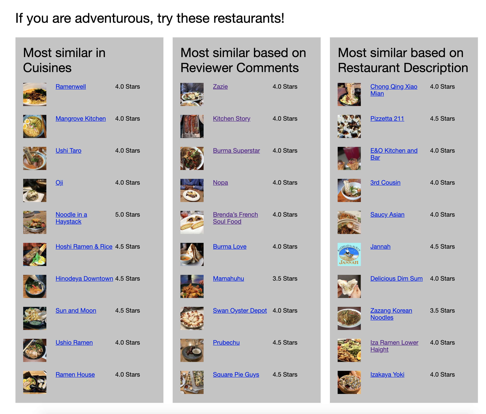

# Restaurant Recommender

### Premise

Imagine after a stressful day at work, or a late night flight back to San Francisco. You are hungry and have no idea where to go for dinner. There are a few restaurants that you frequent and they are closed or you wanted to try something different. It is difficult to decide on where to go if you have no recommendation system to do that. My goal is to build a recommendation system that will help users recommend a few choices based on some of the restaurants that they love. I will be using different factors, like cuisines, ratings and prices, and Natural Language Processing (NLP) to recommend restaurants for users.

### Setup
I scraped the data from Yelp and saved it into a MongoDB database. Once I got the data, I converted the data into a csv format. 
This file shows the setup: `src/convert_to_csv.py` \
EDA: `src/eda_restaurants.py` & `src/eda_users.py` \
Recommendations: `src/recommendations.py`

### Data
The data I am collecting is for San Francisco Restaurants.

Data Collected:
- 1000 restaurants\
  **Title**: Name of Restaurant \
  **Image URL**: Image of Restaurant \
  **URL**: Link to Yelp Page \
  **Price**: Price of Restaurant (Range: 1 - 4) \
  **Stars**: Ratings (Range: 1 - 5) \
  **reviewCount**: Number of reviews per restaurant \
  **Ambience**, **Cuisines**, **Noise Level**, **Parking**: Characteristic of Restaurants \
  **Description**: Description of Restaurant \
- 312k users\
  **userid**: Id of User\
  **name**: Name of user\
  **city**: City where user is from\
  **state**: State where user is from\
  **reviews**: Number of Reviews by user\
  **date**: Date when review is written\
  **reviews**: Description of review\
- 715k reviews\
  **userid**: Id of User\
  **restaurant_id**: Id of Restaurant\
  **ratings**: Rating user gave to particular restaurant\

The data is too big and therefore I didn't push it up to GitHub.

### Workflow

### EDA
I grouped the restaurants based on the neighborhood and did an analysis on the number of reviews per neighborhood

From the graph, the Mission Neighborhood has the highest number of reviews.

Here is a breakdown based on:

1. Ambience

2. Noise Level

3. Alcohol

Here is a graph of the number of reviews based on ratings

#### Reviewers by City

### Modeling
I did a modeling on the item-item content based filtering to figure out which algorithm will return the lowest rmse.

Here is the result:

Based on the diagram, BaselineOnly has the lowest rmse.

### Recommender System

#### Content Based Filtering
Restaurants have different properties, e.g. neighborhood, ambience, cuisines, price, noise level etc

I decide to build the model based on certain factors that will guide my recommendation. As a user, when I search for a restaurant, I tend to look for similar restaurants with the same cuisines, price range and ratings. These factors helped me with deciding on the cuisines, price and stars as my input to build a similarity matrix to recommend restaurants. I broke down the cuisines field into dummies and combine with the price and stars column to generate the matrix for my recommendation.

#### Text Based Filtering
The next 2 recommenders are based on text from the restaurants. One is from the reviews by users and the other, description about the restaurant.

Based on Reviews by the users, I created a similarity matrix and built a recommender based on that. Similarly, I used the description of the restaurants to generate a recommender as well.

### Challenges
Collaborative Filtering is one method that I wanted to use. This became a challenge as many reviewers have not been to most of the restaurants listed and the sparsity of the matrix is really huge. This leads to a lack of data needed to generate a collaborative filtering matrix, which leads to incorrect recommendations.

### Tools Used
Python, BeautifulSoup, Selenium, Jupyter Notebook, Pandas, MongoDB, Docker, Matplotlib, Flask

### Flask
I created a Web App to showcase my recommenders. User will input a restaurant and the app will generate the recommender restaurants.

Here are some screenshots:

### Future Work
Personalize recommender based on Reviewers. Depending on where the reviewers go, the ratings they rate, I will like to create a personal recommender based on user's profile.

### Slides
[Restaurant Recommender] (https://docs.google.com/presentation/d/1CBDj5Oshk4GpeSsIDm3g39pCO4FgKmNvLwXSpEjifbc/edit?usp=sharing)

### Source
Yelp Website
